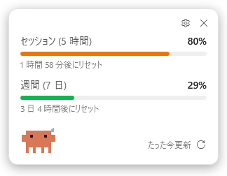
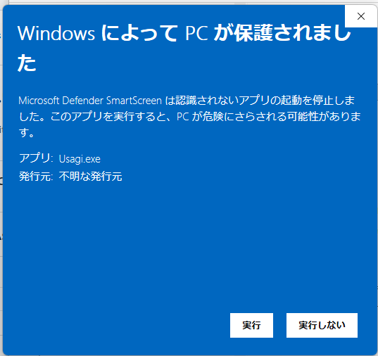
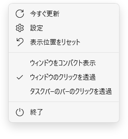
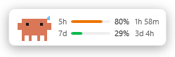
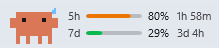
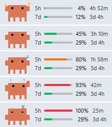
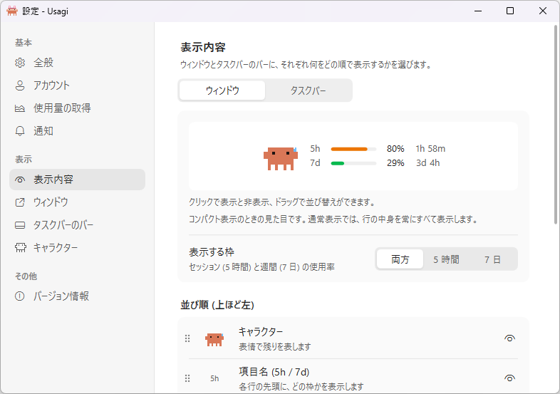
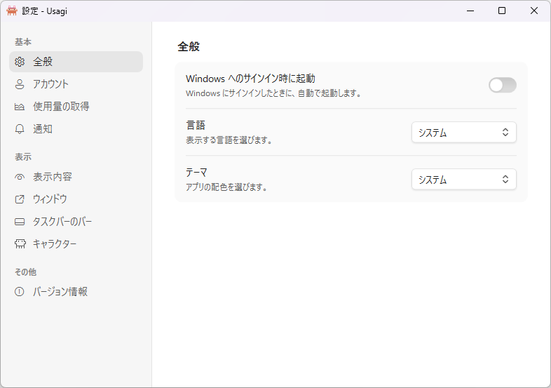
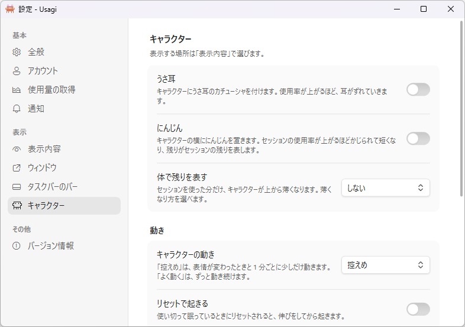

# Usagi — Claude Code usage monitor for Windows

Claude Code の使用量 (5 時間のセッション枠・7 日間の週間枠) を、タスクトレイに常駐して表示する Windows アプリです。名前は usage (使用量) と「ウサギ」から。

> 個人が作っている非公式のアプリです。Anthropic が提供・公認・サポートしているものではありません。



- トレイアイコンのリングで、セッション枠の使用率と状態をひと目で確認
- クリックで開くフライアウトに、各枠の使用率とリセットまでの時間を表示
- フライアウトは大きさ・不透明度を変えられ、2 行だけのコンパクト表示や、クリックを後ろに通す設定も可能
- タスクバーの通知領域の左に、使用率のバーを常時表示 (モニターごとに設定可能)
- セッション枠・週間枠の使用率が指定した値 (既定は 75% / 90% / 95%) に達したときと、枠のリセット時に Windows 通知
- 既定では使用量を消費せずに取得 (5 分ごと)。細かく更新したい場合は 1 トークンのプロンプトで取得する方法も選択可能
- ライト / ダーク テーマ、日本語 / 英語表示に対応
- Windows 版に加え、WSL 内の Claude Code にも対応
- Claude デスクトップアプリのサインインでも取得可能 (Claude Code CLI のインストールは不要。期限切れもほぼ起きません)
- 設定の **バージョン情報** から、ワンクリックで最新版を確認

## 動作要件

- Windows 10 バージョン 1809 以降、または Windows 11
- Claude デスクトップアプリ、または [Claude Code](https://docs.anthropic.com/en/docs/claude-code/overview) (Windows 側か WSL 側) のどれか
- ビルドには [.NET 10 SDK](https://dotnet.microsoft.com/download)、実行には .NET 10 Desktop Runtime

## インストール

[Releases](https://github.com/shizukulab/Usagi/releases) から最新の `Usagi-<バージョン>-win-x64.zip` をダウンロードし、好きなフォルダーに展開して `Usagi.exe` を起動します。新しいバージョンにするときは、アプリを終了してからフォルダーの中身を置き換えてください (設定は `%APPDATA%` にあるので引き継がれます)。

> [!NOTE]
> Usagi.exe にはコード署名がないため、初めて起動すると「Windows によって PC が保護されました」(Microsoft Defender SmartScreen) と表示されることがあります。その場合は **詳細情報** → **実行** を押してください。次回からは表示されません。
>
> 
>
> 展開する前に zip を右クリック → **プロパティ** → **許可する** にチェックを入れて OK を押しておくと、この警告は表示されません。

## ビルドと起動

```powershell
# ビルドして起動
dotnet run --project src/Usagi.App

# 配布用に発行 (publish/Usagi.exe が生成されます)
dotnet publish src/Usagi.App -c Release -r win-x64 --self-contained false -o publish
```

## 使い方

### トレイアイコン

リングはセッション枠の使用率を、色はその使用率の高さを表します。フライアウトやタスクバーのバーと同じ色分けです。


| 色 | 状態 | 使用率 |
|---|---|---|
| 緑 | 余裕あり | 70% 未満 |
| 橙 | 注意 | 70% 以上 |
| 赤 | 危険 | 90% 以上 |

設定の **トレイアイコン** で、表示方法を **リング** (既定) / **二重リング** (外側がセッション枠、内側が週間枠) / **数字** (セッション枠の使用率) / **数字 (キャラクター)** (オレンジ色のドット絵のキャラクターの上に数字。数字の色が状態を表し、白・黄・暗い赤の順に高くなります) から選べます。二重リングの内側の輪も、週間枠の使用率で同じように色分けします。

左クリックでフライアウトを開閉します。右クリックのメニューには次の項目があります。

| 項目 | 内容 |
|---|---|
| 今すぐ更新 | 使用量を取得し直します |
| 設定 | 設定画面を開きます |
| 表示位置をリセット | フライアウトを既定の位置に戻します |
| ウィンドウをコンパクト表示 | フライアウトのコンパクト表示を切り替えます |
| ウィンドウのクリックを透過 | フライアウトのクリック透過を切り替えます |
| タスクバーのバーのクリックを透過 | タスクバーのバーのクリック透過を切り替えます (バーを表示しているときのみ) |
| 終了 | アプリを終了します |

オンになっている切り替え項目には、チェックマークが付きます。同じメニューは、フライアウトやタスクバーのバーを右クリックしても開けます (クリック透過の間は **Ctrl** を押しながら右クリック)。



### フライアウト

- **セッション (5 時間)** / **週間 (7 日)**: 使用率とリセットまでの時間。設定の **リセットの表示** を **時刻** にすると、「23:57 にリセット」のようにリセットされる時刻で表示します
- **右下の「たった今更新」など**: 最終更新時刻 (マウスを乗せると正確な時刻)
- **⟳**: 今すぐ更新
- **⚙**: 設定を開く
- **✕**: フライアウトを閉じる (アプリは終了しません)

フライアウトはどこでもドラッグして移動でき、その位置は次回 (Windows の再起動後も) 覚えています。移動したことがなければ、Windows 11 のクイック設定と同じく、タスクバーのトレイ側の隅 (タスクバーが下なら右下) に開きます。モニターを外すなどで保存した位置が画面外になった場合は、いちばん近いモニターの画面内に表示します。サインインや通信に問題があるときは警告が表示されます。

見た目と操作は次のように変えられます。

| 機能 | 内容 | 変え方 |
|---|---|---|
| 大きさ | 文字やバーも含めて全体を 50〜150% に拡大縮小します。100% 付近では 100% に吸着します | フライアウトの端や角をドラッグ、または設定の **拡大率** |
| 不透明度 | 20〜100%。下げるほど後ろが透けて見えます | 設定の **不透明度** |
| コンパクト表示 | 項目ごとに 1 行 (短い項目名・バー・使用率・残り時間) だけの小さな表示にします。ボタンは表示されません | フライアウトをダブルクリック、トレイメニュー、または設定 |
| クリックの透過 | フライアウト上のマウス操作を、後ろのウィンドウにそのまま通します。**Ctrl** を押している間だけ、フライアウトを操作できます | トレイメニュー、または設定 |



コンパクト表示やクリック透過の間は **✕** を押せないので、フライアウトはトレイアイコンの左クリックで閉じてください。

### タスクバーのバー

設定の **タスクバーにバーを表示** をオンにすると、タスクバーの通知領域の左に、使用率のバーを常に表示します (既定はオフ)。



- クリックでフライアウトを開閉し、左右にドラッグすると位置を変えられます
- 右クリックで、トレイアイコンと同じメニューを開きます
- カーソルを載せると、正式な項目名とリセットまでの時間を表示します
- 文字の色は、アプリのテーマではなく Windows のモード (タスクバーの明暗) に合わせます
- モニターが複数あるときは、各モニターのタスクバーに表示します。表示するかどうかと位置は、モニターごとに設定できます
- 残り時間は `45m` / `2h 15m` / `3d 4h` の形で表示します。設定の **リセットの表示** が **時刻** のときは、`23:57` / `金 2:08` のようにリセットされる時刻を表示します

設定の **キャラクター** にある **タスクバーのバーに表示** をオンにすると、バーの左に、使用率に合わせて表情が変わるドット絵のキャラクターを表示します (既定はオフ)。



| 使用率 (セッションと週間の高いほう)    | 表情             |
| ---------------------- | -------------- |
| セッションが 10% 未満 (リセット直後) | きらきらの中で小さく跳ねる  |
| 70% 未満                 | 普通の顔で、ときどき瞬き   |
| 70% 以上                 | 目が泳ぎ、汗が流れる     |
| 90% 以上                 | 慌てて腕をばたつかせる    |
| 100%                   | 目を閉じて眠り、z が浮かぶ |

表情をセッションだけ、または週間だけで決めたいときは、設定の **表情に使う使用率** で選べます (既定は高いほう)。

どのくらい動くかは、設定の **キャラクターの動き** で選べます。

| 動き | 内容 |
|---|---|
| 動かさない | 表情は使用率に合わせて変わりますが、動きません |
| 控えめ (既定) | 表情が変わったときと、その後は 1 分ごとに数秒だけ動きます。普通の顔のときは瞬きだけです |
| よく動く | ずっと動き続けます。普通の顔のときも、周りを見たり跳ねたりします |

設定の **うさ耳** をオンにすると、キャラクターにピンクのうさ耳のカチューシャを付けます (既定はオフ)。つけ耳なので、跳ねると少し遅れてついてきて、使用率が上がるほどずれていきます。

設定の **にんじん** をオンにすると、キャラクターの横ににんじんを 1 本置きます (既定はオフ)。セッション枠の残りを表していて、使用率が上がるたびに先からかじられて短くなり、使い切ると葉だけが残ります。食べた分は薄い影で残るので、元の長さと比べられます。セッションがリセットされると、新しい 1 本に戻ります。

同じキャラクターは、設定の **キャラクター** にある **ウィンドウに表示** でフライアウトにも表示できます (左下の隅。コンパクト表示では行の左)。

次のときはバーを表示しません。

- タスクバーが縦置きのとき
- タスクバーが自動的に隠れている間
- 全画面表示のアプリがタスクバーを覆っている間 (**全画面表示のアプリの上にも表示** をオンにすると、暗い背景を付けて表示します)

Windows 11 にはタスクバーに部品を埋め込む公式の仕組みがないため、タスクバーの上に小さなウィンドウを重ねて表示しています。そのため、タスクバーのアプリアイコンが通知領域の近くまで並ぶと、バーとアイコンが重なります。その場合は、項目名や残り時間を消して幅を狭くするか、位置をずらしてください。

### 設定



変更はその場で保存・反映されます。左側のページは 3 つのまとまりに分かれています。

- **基本**: アプリ全体の動作と、使用量の取得元 (全般 / アカウント / 使用量の取得 / 通知)
- **表示**: 何を、どこに表示するか (表示内容 / ウィンドウ / タスクバーのバー / キャラクター)
- **その他**: バージョン情報

**全般**

| 項目 | 内容 |
|---|---|
| Windows へのサインイン時に起動 | Windows にサインインしたときに自動で起動します |
| 言語 / テーマ | ドロップダウンで選びます。既定は Windows の設定に従います |



**アカウント**

| 項目 | 内容 |
|---|---|
| Claude Code のアカウント | どのサインイン (デスクトップアプリ / Claude Code のアカウント) を使っているかを表示します。サインインや切り替えは Claude 側で行います |
| 接続テスト | **確認** を押すと、実際に使用量を取得できるか確認できます |

**使用量の取得**

| 項目        | 内容                                                                                                                    |
| --------- | --------------------------------------------------------------------------------------------------------------------- |
| 使用量を消費しない | オンのときは使用量を消費せずに取得し、更新は 5 分ごとになります。オフにすると 1 トークンのプロンプトで取得し、更新間隔を自由に設定できます (既定はオン)                                      |
| 更新間隔      | **使用量を消費しない** をオフにしたときの更新間隔。10〜3600 秒 (既定 60 秒)。入力欄の下に、その間隔での 1 時間あたりの消費トークンの目安が表示されます。↑ / ↓ キーやマウスホイールでも 5 秒ずつ変更できます |

**通知**

| 項目 | 内容 |
|---|---|
| 使用率の通知 | 使用率の通知とセッション枠のリセット通知 (既定はオン) |
| 通知する使用率 | 通知する使用率を 5 個まで指定します (既定は 75% / 90% / 95%)。数字を入れて **+** で追加し、**✕** で削除します。右端の ↺ で既定に戻せます |
| 週間枠の通知 | 週間枠の使用率が同じ値に達したときと、週間枠のリセット時にも通知します (既定はオン) |

**表示内容**

ウィンドウ (フライアウト) とタスクバーのバーに、それぞれ何をどの順で表示するかを選びます。上のタブで **ウィンドウ** と **タスクバー** を切り替えます。

表示できる要素は **キャラクター**・**項目名** (`5h` / `7d`)・**バー**・**使用率の数字**・**リセットまでの時間** の 5 つで、それぞれ表示と非表示、並び順を選べます (既定はすべて表示、キャラクター → 項目名 → バー → 数字 → リセットまでの時間の順)。

- **プレビュー**: 要素をクリックすると表示と非表示が切り替わり、左右にドラッグすると並び替えられます。非表示の要素は点線で薄く表示されます
- **並び順のリスト**: 同じ要素の一覧です。上下にドラッグして並び替え (上にあるものほど左)、目のアイコンで表示と非表示を切り替えます。プレビューとリストは連動していて、カーソルを乗せた要素はもう一方でも強調されます
- **表示する枠**: **両方** / **5 時間** / **7 日** から、どの使用率の行を表示するかを選びます (既定は **両方**)

- キャラクター・バー・数字のどれか 1 つは必ず表示します (使用率が分からなくならないように)。キャラクターだけを残すと、キャラクターだけの表示になります。数字はカーソルを乗せると確認できます。**にんじん** や **体で残りを表す** と組み合わせると、キャラクターだけで残りが分かります
- キャラクターを途中に並べると、その左右に行が分かれて並びます (例: `5h 2h30m 🐰 ▬▬▬`)
- ウィンドウの要素と並び順は、コンパクト表示のときに反映されます。通常表示では常にすべて表示し、キャラクターは左下に置きます
- タスクバーのタブは、**タスクバーのバー** がオンのときに選べます。オフのときは、タブの中の **オンにする** でオンにできます

**表示形式** では、どちらにも共通の表し方を選びます。

| 項目 | 内容 |
|---|---|
| リセットの表示 | リセットを、それまでの残り時間で表示するか、リセットされる時刻で表示するか (既定は残り時間) |
| トレイアイコン | リング / 二重リング / 数字 / 数字 (キャラクター) (既定はリング) |

**ウィンドウ**

フライアウトの設定です。上の 3 つが動作、**見た目** の 3 つが大きさや透け具合です。

| 項目 | 内容 |
|---|---|
| 起動時にウィンドウを開く | 起動したときにウィンドウ (フライアウト) を開きます。オフにすると、タスクバーのバーとトレイアイコンだけで起動します。タスクバーのバーがオンのときは、**タスクバーのバー** のページにも「起動時はタスクバーのバーだけにする」として表示されます (既定はオン) |
| 常に最前面に表示 | フライアウトをほかのウィンドウより手前に表示します (既定はオン) |
| クリックを透過 | フライアウト上のマウス操作を後ろのウィンドウに通します (既定はオフ) |
| コンパクト表示 | フライアウトを項目ごとに 1 行の小さな表示にします (既定はオフ) |
| 不透明度 | フライアウトの不透明度 (20〜100%、既定 100%) |
| 拡大率 | フライアウト全体の大きさ (50〜150%、既定 100%) |

**タスクバーのバー**

| 項目              | 内容                                                                        |
| --------------- | ------------------------------------------------------------------------- |
| タスクバーにバーを表示     | タスクバーのバーを表示します (既定はオフ)。以下の項目は、これがオンのときだけ変更できます                            |
| 全画面表示のアプリの上にも表示 | 全画面のゲームや動画がタスクバーを覆っている間も、バーを表示します (既定はオフ)                                 |
| クリックを透過         | バー上のマウス操作を、下のタスクバーや全画面のアプリに通します。**Ctrl** を押している間だけ、クリックやドラッグができます (既定はオフ) |
| ディスプレイ 1、2…     | モニターごとに、バーを表示するかどうかと、自動で決まる位置からのずれ (-3000〜300px) を設定します                   |

**キャラクター**

キャラクターの **見た目** と **動き** です。表示する場所は **表示内容** で選びます。

**見た目** (どちらに表示しているキャラクターにも効きます):

| 項目 | 内容 |
|---|---|
| うさ耳 | キャラクターに、うさ耳のカチューシャを付けます (既定はオフ) |
| にんじん | キャラクターの横ににんじんを置きます (既定はオフ)。セッションの使用率が上がるほどかじられて短くなります |
| 体で残りを表す | セッションを使った分だけ、キャラクターが上から薄くなります: しない / 薄い色 / 影 / 点々 (既定はしない)。体と脚の 16 段で表し、目は薄くなりません |
| 表情に使う使用率 | 表情をどの使用率で決めるか: 高いほう / セッション / 週間 (既定は高いほう)。**週間** のときは、きらきらの顔も週間が 10% 未満のときになります |

**動き** (反応と気まぐれな行動は既定でオフ。**キャラクターの動き** が **動かさない** のときは働きません):

| 項目        | 内容                                                                                                                        |
| --------- | ------------------------------------------------------------------------------------------------------------------------- |
| キャラクターの動き | 動かさない / 控えめ / よく動く (既定は控えめ)                                                                                               |
| リセットで起きる  | 使い切って眠っているときにリセットされると、伸びをしてから起きます                                                                                         |
| 急に増えたら驚く  | セッションの使用率が前回の取得から 10 ポイント以上増えていると、一瞬びくっとします                                                                               |
| 通知の使用率で看板を掲げる | セッションの使用率が **通知する使用率** (75% など) を超えると、その数字の看板を頭の上に掲げます |
| カーソルを目で追う | カーソルが近くにあると、目がそちらを向きます。困っているときや眠っているときは追いません                                                                              |
| 気まぐれな行動   | 使用率に余裕があるとき (普通の顔のとき)、数分に 1 回、どれか 1 つを演じます: きょろきょろ、のび、なわとび、読書、くるっと回る、鼻歌、スクワット、かくれる、ジャンプ (着地でつぶれて伸びる)、バンザイ。朝 (5〜10 時) は太陽の下でのび、お昼 (11〜14 時) はおにぎり、夜 (22〜4 時) はナイトキャップをかぶってあくびも加わります。間隔は **控えめ** で 3〜6 分、**よく動く** で 1〜3 分です |


**バージョン情報**

使用中のバージョンと、アップデートの状態を表示します。**最新版を確認** を押すと、GitHub の [最新リリース](https://github.com/shizukulab/Usagi/releases/latest) と比べます。

| 状態                | 表示                                          |
| ----------------- | ------------------------------------------- |
| 最新の状態です           | 使用中のバージョンが最新です。前回確認した日時も表示します               |
| バージョン ○ が利用できます   | 新しいバージョンがあります。**ダウンロード** でリリースページがブラウザで開きます |
| アップデートを確認できませんでした | GitHub に接続できませんでした                          |

- 確認するのはボタンを押したときだけです。バックグラウンドでの確認や通知はしません
- アプリが自分でダウンロードやインストールをすることはありません
- 下書きとプレリリース (`v1.3.0-beta.1` など) は対象外です
- 確認の結果は再起動後も表示されます

**リンク** から、リリースノートと GitHub のリポジトリを開けます。

## サインイン

このアプリは独自のサインイン機能を持たず、Claude デスクトップアプリか Claude Code のサインインを読み取って使います。サインイン、アカウントの切り替え、サインアウトは、すべて Claude 側で行ってください。

- **デスクトップアプリ**: サインインしていれば、それだけで使用量を表示できます (Claude Code のインストールは不要)。サインインは有効期間が長く、アプリ自身が更新し続けるため、期限切れになることはほとんどありません
- **Claude Code**: `claude auth login` (WSL 内だけで使っている場合は WSL 内で) でサインインします

どこにもサインインしていないときや、サインインが拒否されたときは、フライアウトにデスクトップアプリでのサインインを促す表示が出ます。Claude 側でサインインすると、アプリが自動で検知して使用量を取得し直します。

Claude Code をしばらく使わずにサインインの有効期限が切れると、「期限切れ」と表示されます。次に Claude Code を使えば自動で更新され、表示も戻ります。サインインし直す必要はありません。

## 通知

**使用率の通知** がオンのとき、次のタイミングで通知します。

- セッション枠の使用率が、設定の **通知する使用率** で指定した値 (既定は 75% / 90% / 95%) に達したとき (それぞれ 1 回)
- セッション枠がリセットされたとき
- **週間枠の通知** がオンのときは、週間枠についても同じ値に達したとき (それぞれ 1 回) と、リセットされたとき

一度に複数の値を超えたとき (アプリを起動していない間に使用率が上がった場合など) は、いちばん高い値だけを通知します。通知済みの記録は枠ごとに持っていて、アプリを起動していない間に枠がリセットされた場合も、新しい枠ではあらためて通知します。

## 仕組み

Claude デスクトップアプリか Claude Code の認証情報を読み取り (書き込みはしません)、Anthropic の API から使用量を取得します。次の順に探し、最初に見つかった有効なものを使います。

1. Claude デスクトップアプリ: `%APPDATA%\Claude\config.json` (Microsoft Store 版はそのパッケージ内の同じ場所)。デスクトップアプリはトークンを Chromium と同じ方式で暗号化して保存しているため、同じフォルダーの `Local State` にある鍵を Windows の DPAPI で復号して読み取ります。この鍵は Windows のユーザーに結び付いていて、本人のアカウントでしか復号できません
2. Windows の Claude Code: `%USERPROFILE%\.claude\.credentials.json` (`CLAUDE_CONFIG_DIR` があればその下)
3. WSL の Claude Code: 各ディストリビューションの `~/.claude/.credentials.json` (`wsl.exe` 経由)

デスクトップアプリのトークンが複数ある場合は、Claude Code 用のもの (`user:sessions:claude_code` スコープ) を優先します。

| 設定 | 取得方法 | 使用量の消費 | 更新間隔 |
|---|---|---|---|
| 使用量を消費しない (既定) | 使用量 API (`/api/oauth/usage`) から読み取る | なし | 5 分固定 |
| 使用量を消費しない をオフ | Messages API (Haiku 4.5) に `.` だけのプロンプトを送り (出力は 1 トークン)、レスポンスのレート制限ヘッダーから読み取る | 1 回約 10 トークン | 10〜3600 秒 |

1 トークンのプロンプトで取得する場合の消費量の目安は次のとおりです。Claude Code に 1 回指示を出すだけでも、通常は数千〜数万トークンを使います。

| 更新間隔 | 1 時間あたり | 8 時間あたり |
|---|---|---|
| 10 秒 | 約 3,600 トークン | 約 28,800 トークン |
| 60 秒 (既定) | 約 600 トークン | 約 4,800 トークン |
| 300 秒 | 約 120 トークン | 約 960 トークン |

トークン数が使用量の枠にどう換算されるかは公開されていないため、あくまで目安です。

Haiku 4.5 が廃止された場合は、使えるモデルの一覧 (取得に使用量は消費しません) から最も安いもの (新しい Haiku → Sonnet → Opus の順) に自動で切り替えます。使用中のモデルは設定画面の更新間隔の下に表示されます。

使用量 API は短い間隔で呼ぶと一時的に制限され (HTTP 429)、1 時間以上解けないこともあるため、5 分間隔に固定しています。制限されたときは次の 1 回を飛ばし、10 分後に再試行します (成功するまで 10 分間隔、成功すると 5 分間隔に戻ります)。⟳ や右クリックメニューからの手動更新も、前回の取得から 2 分以内は使用量 API を呼ばず、フライアウト下部に「あと ○ 分で更新できます」と表示します。制限中は最後に取得した値を表示し続けます。

## 設定ファイル

設定は `%APPDATA%\Usagi\settings.json` に保存されます (自動起動のみレジストリの `HKCU\Software\Microsoft\Windows\CurrentVersion\Run`)。

| キー | 内容 | 既定値 |
|---|---|---|
| `RefreshIntervalSeconds` | 更新間隔 (秒、10〜3600) | `60` |
| `AvoidTokenUsage` | 使用量を消費しない | `true` |
| `NotificationsEnabled` | 使用率の通知 | `true` |
| `NotificationThresholds` | 通知するセッション使用率 (1〜100、5 個まで) | `[75, 90, 95]` |
| `WeeklyNotificationsEnabled` | 週間枠も通知する | `true` |
| `ResetTimeDisplay` | リセットの表示: `Remaining` (残り時間) / `Clock` (時刻) | `Remaining` |
| `TrayIconStyle` | トレイアイコン: `Ring` / `DoubleRing` / `Number` / `NumberOnCreature` | `Ring` |
| `ShowFlyoutOnStartup` | 起動時にウィンドウ (フライアウト) を開く | `true` |
| `AlwaysOnTop` | フライアウトを常に最前面に表示 | `true` |
| `Theme` | `System` / `Light` / `Dark` | `System` |
| `Language` | `System` / `English` / `Japanese` | `System` |
| `FlyoutOpacityPercent` | フライアウトの不透明度 (%、20〜100) | `100` |
| `FlyoutScale` | フライアウトの拡大率 (0.5〜1.5) | `1` |
| `VisibleRows` | フライアウトに表示する行: `Both` / `SessionOnly` / `WeeklyOnly` | `Both` |
| `FlyoutPartOrder` | コンパクト表示のフライアウトの要素の並び順 (左から): `Mascot` / `Labels` / `Bar` / `Percentage` / `ResetTime` | `["Mascot", "Labels", "Bar", "Percentage", "ResetTime"]` |
| `CompactShowLabels` | コンパクト表示のフライアウトに項目名を表示 | `true` |
| `CompactShowBar` | コンパクト表示のフライアウトにバーを表示 (`CompactShowPercentage` と `FlyoutShowMascot` もオフのときは表示) | `true` |
| `CompactShowPercentage` | コンパクト表示のフライアウトに使用率の数字を表示 | `true` |
| `CompactShowResetTime` | コンパクト表示のフライアウトにリセットを表示 | `true` |
| `FlyoutCompact` | フライアウトのコンパクト表示 | `false` |
| `FlyoutClickThrough` | フライアウトのクリック透過 | `false` |
| `FlyoutShowMascot` | フライアウトにキャラクターを表示 | `true` |
| `MascotAnimation` | キャラクターの動き (フライアウトとタスクバーの両方): `Off` / `Subtle` / `Lively` | `Subtle` |
| `MascotBunnyEars` | キャラクターにうさ耳を付ける (フライアウトとタスクバーの両方) | `false` |
| `MascotCarrot` | キャラクターの横ににんじんを置く (フライアウトとタスクバーの両方) | `false` |
| `MascotBodyGauge` | キャラクターの体で残りを表す: `None` / `Pale` / `Shadow` / `Dots` | `None` |
| `MascotMoodSource` | キャラクターの表情を決める使用率: `Higher` (セッションと週間の高いほう) / `Session` / `Weekly` | `Higher` |
| `MascotWakesOnReset` | 眠っているキャラクターが、リセットで伸びをして起きる | `false` |
| `MascotStartlesOnJump` | セッションの使用率が急に増えると、キャラクターが驚く | `false` |
| `MascotHoldsSign` | セッションの使用率が通知する使用率を超えると、キャラクターがその数字の看板を掲げる | `false` |
| `MascotFollowsCursor` | キャラクターが近くのカーソルを目で追う | `false` |
| `MascotIdleActs` | キャラクターが、余裕のあるときに気まぐれな行動をする | `false` |
| `ShowTaskbarBar` | タスクバーのバーを表示 | `false` |
| `ShowTaskbarBarOverFullScreen` | 全画面表示のアプリの上にもバーを表示 | `false` |
| `TaskbarBarClickThrough` | タスクバーのバーのクリック透過 | `false` |
| `TaskbarBarVisibleRows` | タスクバーのバーに表示する行: `Both` / `SessionOnly` / `WeeklyOnly` | `VisibleRows` と同じ |
| `TaskbarBarShowLabels` | タスクバーのバーに項目名を表示 | `CompactShowLabels` と同じ |
| `TaskbarBarPartOrder` | タスクバーのバーの要素の並び順 (左から)。値は `FlyoutPartOrder` と同じ | `FlyoutPartOrder` と同じ既定値 |
| `TaskbarBarShowBar` | タスクバーのバーにバーを表示 (`TaskbarBarShowPercentage` と `TaskbarBarShowMascot` もオフのときは表示) | `true` |
| `TaskbarBarShowPercentage` | タスクバーのバーに使用率の数字を表示 | `CompactShowPercentage` と同じ |
| `TaskbarBarShowResetTime` | タスクバーのバーにリセットを表示 | `CompactShowResetTime` と同じ |
| `TaskbarBarShowMascot` | バーにキャラクターを表示 | `true` |
| `TaskbarBarDisplays` | モニターごとのバーの設定。キーはモニターのデバイス名 (JSON での表記例: `\\\\.\\DISPLAY2`)、値は `Show` (表示するか) と `Offset` (位置のずれ、-3000〜300) | なし (全モニターに、ずれなしで表示) |

設定とは別に、アプリが自動で記録する状態は同じフォルダーの `state.json` に保存されます。手で編集する必要はありません。削除しても、次の起動時に作り直されます。

| キー | 内容 |
|---|---|
| `FlyoutPosition` | ドラッグで移動したフライアウトの位置 (画面のピクセル座標)。トレイメニューの **表示位置をリセット** で消去されます |
| `NotifiedThresholdKeys` | 通知済みの使用率。同じ通知を繰り返さないための記録です |
| `NotifiedWindowEnds` | 通知済みの使用率を記録した枠がリセットされる時刻。この時刻を過ぎると、通知済みの記録は破棄されます |
| `LastUsageEndpointCall` / `UsageEndpointRateLimited` | 使用量 API を最後に呼んだ時刻と、そのとき制限されたかどうか。アプリを再起動しても呼び出し間隔を守るための記録です |
| `LastUsage` | 最後に取得した使用量。起動直後、最初の取得が終わるまでの表示に使います (1 時間以内のものだけ) |
| `LastUpdateCheck` | 最後に最新版を確認した時刻 |
| `AvailableUpdateVersion` / `AvailableUpdateUrl` | そのとき見つかった新しいバージョンと、そのリリースページ。なければ空です |


## 開発

```
src/
  Usagi.App/        WPF アプリ本体 (画面、ViewModel、テーマ、翻訳、トレイ)
  Usagi.Core/       Windows に依存しないロジック (API クライアント、使用量の取得、通知の判定、状態判定)
  Usagi.Platform/   Windows 固有の処理 (CLI / WSL 呼び出し、デスクトップアプリの認証情報の復号、通知、自動起動、アイコン描画)
tests/
  Usagi.Tests/      ユニットテスト (xUnit)
```

- 依存の向きは App → Platform → Core の一方向です。Core は `net10.0` を対象にしており、Windows 固有の API は使えません
- 画面の文字列は `src/Usagi.App/Localization/` の `Strings.resx` (英語) と `Strings.ja.resx` (日本語) にあります。両方を編集してください
- テストは `dotnet test` で実行します


### リリース

`v` で始まるバージョンのタグを push すると、GitHub Actions ([`.github/workflows/release.yml`](.github/workflows/release.yml)) がテストとビルドを行い、zip を添付したリリースを作成します。リリースノートは前回のリリースからのコミットをもとに自動で作られます。

```powershell
git tag v1.1.0
git push origin v1.1.0
```

- アプリのバージョンはタグから付けられます (`v1.1.0` → `1.1.0`)。ローカルでのビルドは `Directory.Build.props` の `Version` になります
- `v1.2.0-beta.1` のようにハイフンを含むタグはプレリリースになり、アプリの **最新版を確認** の対象になりません

## ライセンス

[MIT License](LICENSE) です。同梱しているライブラリとそのライセンスは [THIRD-PARTY-NOTICES.md](THIRD-PARTY-NOTICES.md) にあります。どちらも配布用の zip に含まれます。

- 「Claude」「Claude Code」「Anthropic」は Anthropic, PBC の商標です。このアプリは Anthropic とは関係のない非公式のもので、名称は対応している製品を示すためだけに使っています
- ドット絵のキャラクターは Claude Code のマスコットをもとに描いたファンアートです。キャラクターに関する権利は Anthropic にあり、MIT License の対象には含みません
